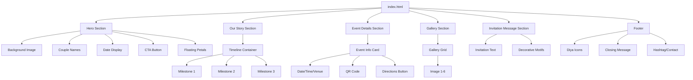

# Design Document

## Overview

The engagement invitation website is a single-page application that combines traditional Indian wedding aesthetics with modern, minimal web design principles. The site features a vertical scroll layout with distinct sections, each showcasing rich cultural elements while maintaining clean, uncluttered presentation. The design prioritizes visual elegance through careful use of the specified color palette, typography hierarchy, and subtle animations that enhance rather than distract from the content.

The website will be delivered as a static HTML/CSS/JavaScript template with clearly marked placeholders, allowing the user to easily customize names, dates, venue information, and images without requiring deep technical knowledge.

## Architecture

### Technology Stack

- **HTML5**: Semantic markup for content structure
- **CSS3**: Custom styling with CSS Grid, Flexbox, animations, and transitions
- **Vanilla JavaScript**: Lightweight interactions (smooth scroll, animations, form handling)
- **Google Fonts API**: Typography loading (Playfair Display, Great Vibes, Poppins)

### File Structure

```
engagement-invitation/
├── index.html              # Main HTML file
├── css/
│   ├── styles.css         # Main stylesheet
│   └── animations.css     # Animation definitions
├── js/
│   └── main.js            # Interactive behaviors
├── assets/
│   ├── images/
│   │   ├── hero-bg.jpg    # Hero background placeholder
│   │   ├── qr-code.png    # QR code placeholder
│   │   ├── gallery/       # Gallery image placeholders
│   │   └── decorative/    # Mandala, diya, floral motifs
│   └── fonts/             # Fallback fonts (optional)
└── README.md              # Customization instructions
```

## Components and Interfaces

### 1. Hero Section

**Purpose**: Create immediate visual impact and communicate essential information (couple's names, date)

**Visual Design**:
- Full viewport height (100vh)
- Background: Overlay image with golden tint (rgba(212, 175, 55, 0.15))
- Centered content with vertical alignment
- Animated entrance: Names fade in with golden glow effect

**Layout Structure**:
```
┌─────────────────────────────────────┐
│     [Background Image + Overlay]     │
│                                      │
│         [Couple's Names]             │
│       (Great Vibes, 4-5rem)         │
│                                      │
│      ❤️ (Heart separator)            │
│                                      │
│     "Join us in celebrating"        │
│        our engagement               │
│                                      │
│      [Date Display]                 │
│                                      │
│    [Save the Date Button]           │
│                                      │
│   [Scroll indicator: ↓]             │
└─────────────────────────────────────┘
```

**Placeholder Markers**:
- `<!-- CUSTOMIZE: Bride Name -->` and `<!-- CUSTOMIZE: Groom Name -->`
- `<!-- CUSTOMIZE: Engagement Date -->`
- `<!-- CUSTOMIZE: Hero Background Image (assets/images/hero-bg.jpg) -->`

**Animations**:
- On load: Names appear with 1.5s fade-in + scale effect
- Continuous: Floating rose petals (CSS animation, 8-10s loop)
- Scroll trigger: Parallax effect on background image

### 2. Our Story Section

**Purpose**: Share the couple's journey through a visual timeline

**Visual Design**:
- Ivory background (#FAF6F0)
- Vertical timeline with alternating left/right content
- Traditional icons (SVG or icon font) at each milestone
- Decorative mandala divider at section top

**Layout Structure**:
```
┌─────────────────────────────────────┐
│      [Mandala Divider]              │
│                                      │
│         Our Story                   │
│      (Playfair Display)             │
│                                      │
│  ○────────────────────────────○     │
│  │  [Icon] How We Met         │     │
│  │  [Image] [Text]            │     │
│  │                            │     │
│  │  First Date [Icon]         │     │
│  │         [Text] [Image]     │     │
│  │                            │     │
│  │  [Icon] The Proposal       │     │
│  │  [Image] [Text]            │     │
│  ○────────────────────────────○     │
└─────────────────────────────────────┘
```

**Timeline Items** (3-4 milestones):
1. How We Met
2. First Date / Special Moment
3. The Proposal
4. Looking Forward (optional)

**Placeholder Markers**:
- `<!-- CUSTOMIZE: Story Milestone 1 Title/Text/Image -->`
- Each milestone wrapped in clearly commented sections

**Styling Details**:
- Timeline line: 2px solid antique gold (#D4AF37)
- Icons: Circular containers with maroon background (#800020)
- Images: Rounded corners (8px), subtle shadow
- Text: Poppins, 1rem, charcoal color (#3E2723)

### 3. Event Details Section

**Purpose**: Communicate when and where the engagement will take place

**Visual Design**:
- Centered card layout with golden border
- Mandala corner decorations (CSS pseudo-elements or SVG)
- QR code prominently displayed
- "Get Directions" button with hover glow effect

**Layout Structure**:
```
┌─────────────────────────────────────┐
│                                      │
│      Event Details                  │
│   (Playfair Display, 2.5rem)       │
│                                      │
│  ╔═══════════════════════════╗     │
│  ║  📅 [Date]                ║     │
│  ║  🕐 [Time]                ║     │
│  ║  📍 [Venue Name]          ║     │
│  ║     [Venue Address]       ║     │
│  ║                           ║     │
│  ║    [QR Code Image]        ║     │
│  ║    (200x200px min)        ║     │
│  ║                           ║     │
│  ║  [Get Directions Button]  ║     │
│  ╚═══════════════════════════╝     │
│                                      │
└─────────────────────────────────────┘
```

**Placeholder Markers**:
- `<!-- CUSTOMIZE: Event Date -->`
- `<!-- CUSTOMIZE: Event Time -->`
- `<!-- CUSTOMIZE: Venue Name and Address -->`
- `<!-- CUSTOMIZE: QR Code (replace assets/images/qr-code.png) -->`
- `<!-- CUSTOMIZE: Google Maps Link -->`

**Styling Details**:
- Card: White background, 3px solid gold border, border-radius 12px
- Mandala corners: Positioned absolutely at all four corners
- QR code: Center-aligned, max-width 250px, margin 20px auto
- Button: Gradient gold border, rounded (25px), hover glow animation

### 4. Gallery Section

**Purpose**: Showcase pre-engagement or family photos

**Visual Design**:
- Masonry grid layout (3 columns desktop, 2 tablet, 1 mobile)
- Subtle golden borders on images
- Hover effect: slight scale + overlay with couple's names

**Layout Structure**:
```
┌─────────────────────────────────────┐
│                                      │
│         Memories                    │
│    (Playfair Display)               │
│                                      │
│  ┌────┐  ┌────┐  ┌────┐            │
│  │ 1  │  │ 2  │  │ 3  │            │
│  └────┘  └────┘  └────┘            │
│  ┌────┐  ┌────┐  ┌────┐            │
│  │ 4  │  │ 5  │  │ 6  │            │
│  └────┘  └────┘  └────┘            │
│                                      │
└─────────────────────────────────────┘
```

**Placeholder Markers**:
- 6-8 image slots with clear naming: `gallery-1.jpg`, `gallery-2.jpg`, etc.
- `<!-- CUSTOMIZE: Replace images in assets/images/gallery/ -->`

**Styling Details**:
- Images: object-fit cover, aspect-ratio 4:3
- Border: 2px solid rgba(212, 175, 55, 0.3)
- Hover: transform scale(1.05), transition 0.3s ease
- Overlay on hover: Semi-transparent maroon with white text

### 5. Invitation Message Section

**Purpose**: Warmly invite guests to attend without requiring RSVP

**Visual Design**:
- Centered text layout
- Decorative floral or lotus motifs flanking the message
- Elegant typography with golden accents

**Layout Structure**:
```
┌─────────────────────────────────────┐
│                                      │
│    [Lotus/Floral Motif]             │
│                                      │
│    "Your presence would be          │
│     an honor and a blessing"        │
│                                      │
│    We hope to see you there!        │
│                                      │
│    [Lotus/Floral Motif]             │
│                                      │
└─────────────────────────────────────┘
```

**Placeholder Markers**:
- `<!-- CUSTOMIZE: Invitation Message -->`

**Styling Details**:
- Main text: Lora or Poppins, 1.25rem, centered
- Accent phrase: Great Vibes, 2rem, antique gold
- Decorative motifs: SVG or icon font, sage green (#C8BCA8)

### 6. Footer

**Purpose**: Provide closing sentiment and optional contact/hashtag

**Visual Design**:
- Dark background (deep maroon #800020)
- Animated diya icons
- Small text with golden accents

**Layout Structure**:
```
┌─────────────────────────────────────┐
│  🪔  🪔  🪔  🪔  🪔                  │
│                                      │
│    With love and gratitude          │
│    [Couple's Names]                 │
│                                      │
│    #[WeddingHashtag]                │
│    [Contact Email]                  │
│                                      │
└─────────────────────────────────────┘
```

**Placeholder Markers**:
- `<!-- CUSTOMIZE: Wedding Hashtag -->`
- `<!-- CUSTOMIZE: Contact Email (optional) -->`

**Styling Details**:
- Background: #800020
- Text: Ivory (#FAF6F0), 0.9rem
- Diyas: Animated flicker effect (opacity pulse)

## Data Models

### Placeholder Content Structure

Since this is a static template, "data" exists as HTML content with clear markers:

```javascript
// Conceptual structure for easy identification
const PLACEHOLDERS = {
  hero: {
    brideName: "[BRIDE NAME]",
    groomName: "[GROOM NAME]",
    date: "[ENGAGEMENT DATE]",
    heroImage: "assets/images/hero-bg.jpg"
  },
  story: {
    milestones: [
      {
        title: "[MILESTONE TITLE]",
        description: "[MILESTONE DESCRIPTION]",
        image: "assets/images/story-1.jpg"
      }
      // ... more milestones
    ]
  },
  event: {
    date: "[EVENT DATE]",
    time: "[EVENT TIME]",
    venueName: "[VENUE NAME]",
    venueAddress: "[VENUE ADDRESS]",
    qrCode: "assets/images/qr-code.png",
    mapsLink: "[GOOGLE MAPS URL]"
  },
  gallery: {
    images: [
      "assets/images/gallery/gallery-1.jpg",
      // ... 6-8 images
    ]
  },
  invitation: {
    message: "[CUSTOM INVITATION MESSAGE]"
  },
  footer: {
    hashtag: "[#WEDDINGTAG]",
    contact: "[EMAIL]"
  }
};
```

## Error Handling

### Image Loading

- **Fallback**: If images fail to load, display placeholder with decorative border and icon
- **Implementation**: CSS background-color on image containers, onerror attribute for img tags

### Font Loading

- **Fallback**: System fonts specified in font-family stack
- **Example**: `font-family: 'Playfair Display', Georgia, serif;`

### Responsive Breakpoints

- **Mobile**: < 768px (single column, larger touch targets)
- **Tablet**: 768px - 1024px (adjusted grid, 2 columns)
- **Desktop**: > 1024px (full layout, 3 columns)

### Browser Compatibility

- **Target**: Modern browsers (Chrome, Firefox, Safari, Edge - last 2 versions)
- **Graceful degradation**: Animations disabled if prefers-reduced-motion is set
- **CSS Grid fallback**: Flexbox for older browsers (optional)

## Testing Strategy

### Visual Testing

1. **Cross-browser testing**: Verify layout and animations in Chrome, Firefox, Safari, Edge
2. **Responsive testing**: Test at breakpoints (375px, 768px, 1024px, 1440px)
3. **Color contrast**: Ensure text meets WCAG AA standards (4.5:1 for body text)
4. **Typography rendering**: Verify font loading and fallbacks

### Functional Testing

1. **Smooth scroll**: Verify scroll behavior between sections
2. **Button interactions**: Test hover states and click actions (Get Directions link)
3. **Animation performance**: Ensure animations run smoothly (60fps target)
4. **Image loading**: Test with slow network to verify loading states

### Accessibility Testing

1. **Keyboard navigation**: Ensure all interactive elements are keyboard accessible
2. **Screen reader**: Test with NVDA/JAWS for semantic HTML
3. **Alt text**: Verify all images have descriptive alt attributes
4. **Focus indicators**: Ensure visible focus states on interactive elements

### Customization Testing

1. **Placeholder replacement**: Verify all placeholders are clearly marked and easy to find
2. **Image swap**: Test replacing images with different aspect ratios
3. **Text modification**: Ensure layout adapts to longer/shorter text content
4. **QR code**: Verify QR code image displays correctly at specified size

## Performance Considerations

### Optimization Techniques

1. **Image optimization**: Compress images (WebP format with JPG fallback)
2. **Font loading**: Use font-display: swap to prevent FOIT (Flash of Invisible Text)
3. **CSS minification**: Minify CSS for production
4. **Lazy loading**: Apply loading="lazy" to gallery images
5. **Animation efficiency**: Use transform and opacity for animations (GPU-accelerated)

### Target Metrics

- **First Contentful Paint**: < 1.5s
- **Largest Contentful Paint**: < 2.5s
- **Total page size**: < 2MB (including images)
- **Animation frame rate**: 60fps

## Design Tokens

### Spacing Scale

```css
--spacing-xs: 8px;
--spacing-sm: 16px;
--spacing-md: 24px;
--spacing-lg: 48px;
--spacing-xl: 72px;
```

### Border Radius

```css
--radius-sm: 4px;
--radius-md: 8px;
--radius-lg: 12px;
--radius-full: 50%;
```

### Shadows

```css
--shadow-sm: 0 2px 4px rgba(0, 0, 0, 0.1);
--shadow-md: 0 4px 8px rgba(0, 0, 0, 0.15);
--shadow-gold: 0 0 20px rgba(212, 175, 55, 0.4);
```

### Transitions

```css
--transition-fast: 0.2s ease;
--transition-base: 0.3s ease;
--transition-slow: 0.5s ease;
```

## Microinteractions Specification

### Button Hover (Golden Glow)

```css
.btn-primary:hover {
  box-shadow: 0 0 20px rgba(212, 175, 55, 0.6);
  transform: translateY(-2px);
  transition: all 0.3s ease;
}
```

### Floating Rose Petals

- **Animation**: Keyframes with translateY and rotate
- **Duration**: 8-10s per petal
- **Count**: 5-7 petals
- **Trigger**: Continuous loop, starts on page load

### Entrance Animation (Couple's Names)

```css
@keyframes golden-reveal {
  0% {
    opacity: 0;
    transform: scale(0.9);
    text-shadow: 0 0 0 rgba(212, 175, 55, 0);
  }
  100% {
    opacity: 1;
    transform: scale(1);
    text-shadow: 0 0 30px rgba(212, 175, 55, 0.8);
  }
}
```

### Diya Flicker (Footer)

```css
@keyframes flicker {
  0%, 100% { opacity: 1; }
  50% { opacity: 0.7; }
}
```

## Customization Guide (README.md Content)

The README.md will include:

1. **Quick Start**: How to open and view the website
2. **Customization Steps**:
   - Replacing couple's names
   - Updating dates and venue
   - Swapping QR code image
   - Adding gallery photos
   - Modifying story timeline
3. **File Locations**: Clear map of where each asset lives
4. **Troubleshooting**: Common issues and solutions
5. **Deployment**: Simple hosting options (GitHub Pages, Netlify, Vercel)

## Mermaid Diagram: Component Hierarchy



This design provides a complete blueprint for implementing the engagement invitation website with all the specified aesthetic and functional requirements while maintaining ease of customization.
